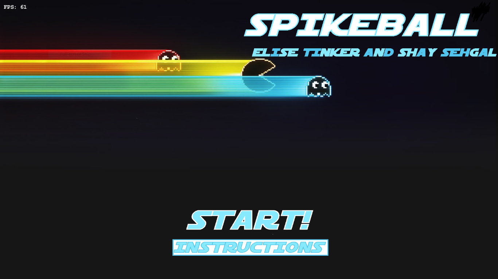
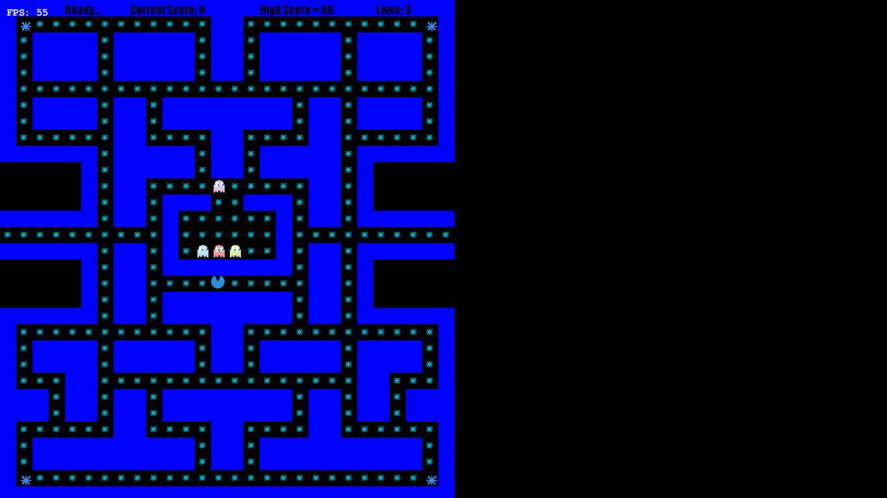
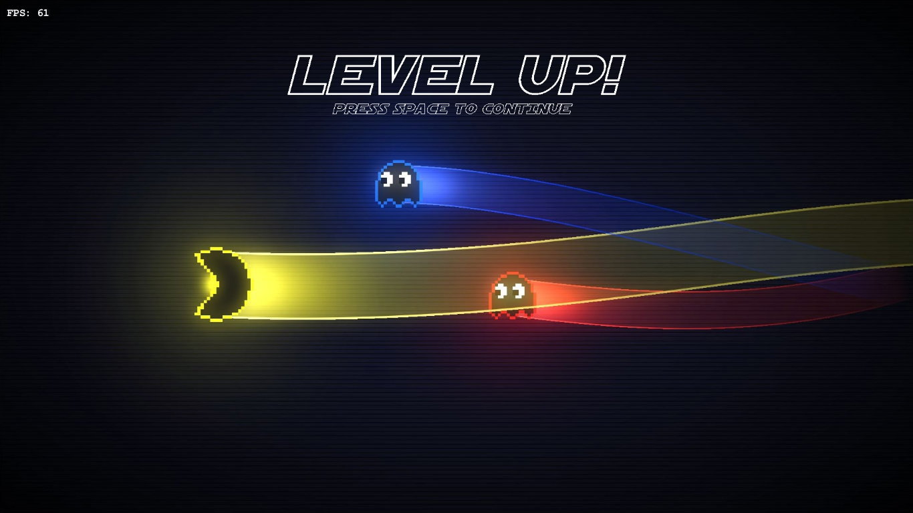
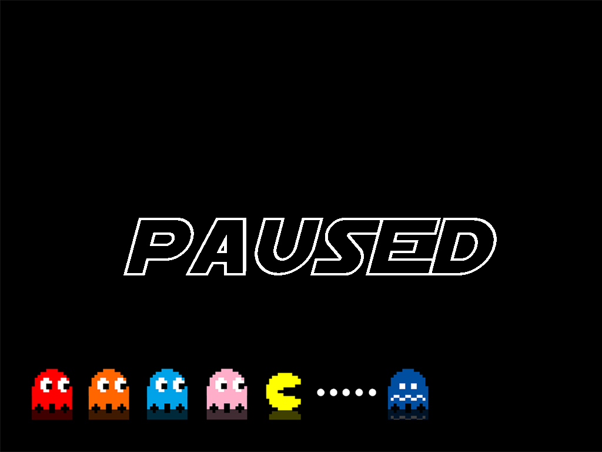
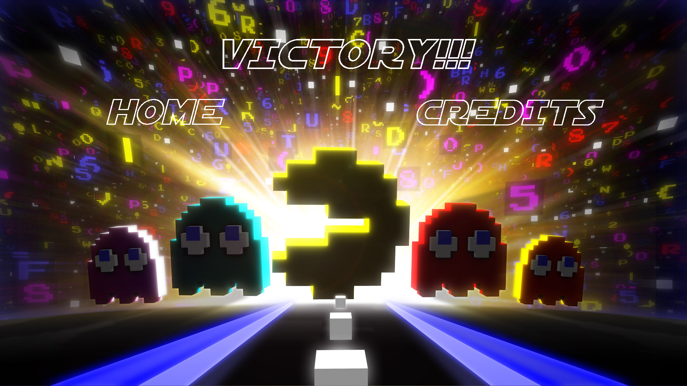
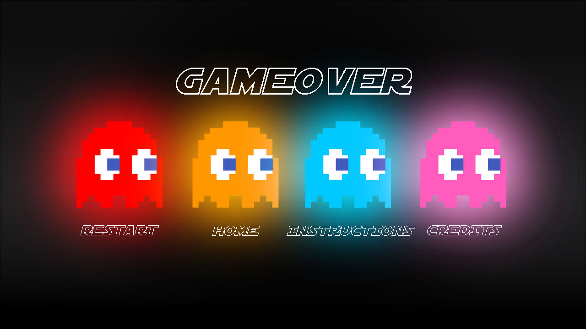

# Pac-Man Game
A Java-based Pac-Man game developed during my senior year of high school, featuring interactive gameplay, graphical user interface components, and game-state management.
## About the Project
This project is a recreation of the classic Pac-Man arcade game developed as a software development project during my senior year of high school. The project provided hands-on experience with Java programming, graphical user interface development, object-oriented programming, game logic, and managing different states of an interactive application.
## Features
- Interactive Pac-Man-style gameplay
- Player-controlled character movement
- Maze-based game environment
- Score tracking
- Game interface and navigation screens
- Level progression
- Pause and game-over functionality
- Victory screen and game-state transitions
- Keyboard-based gameplay controls
## Technologies
- Java → Application logic, game mechanics, and object-oriented programming
- Eclipse → Java development environment used to develop and manage the project
- Slick2D → 2D game development framework used for graphics, input, and game functionality
- GitHub → Version control and project management
## Gameplay Screenshots
| Title Screen | Gameplay | Level Up |
|---|---|---|
|  |  |  |

| Pause | Victory | Game Over |
|---|---|---|
|  |  |  |
## Contributors
### Elise Tinker and Shay Sehgal 
Created Spring 2022 as the cumulative project for my senior year game development class.
